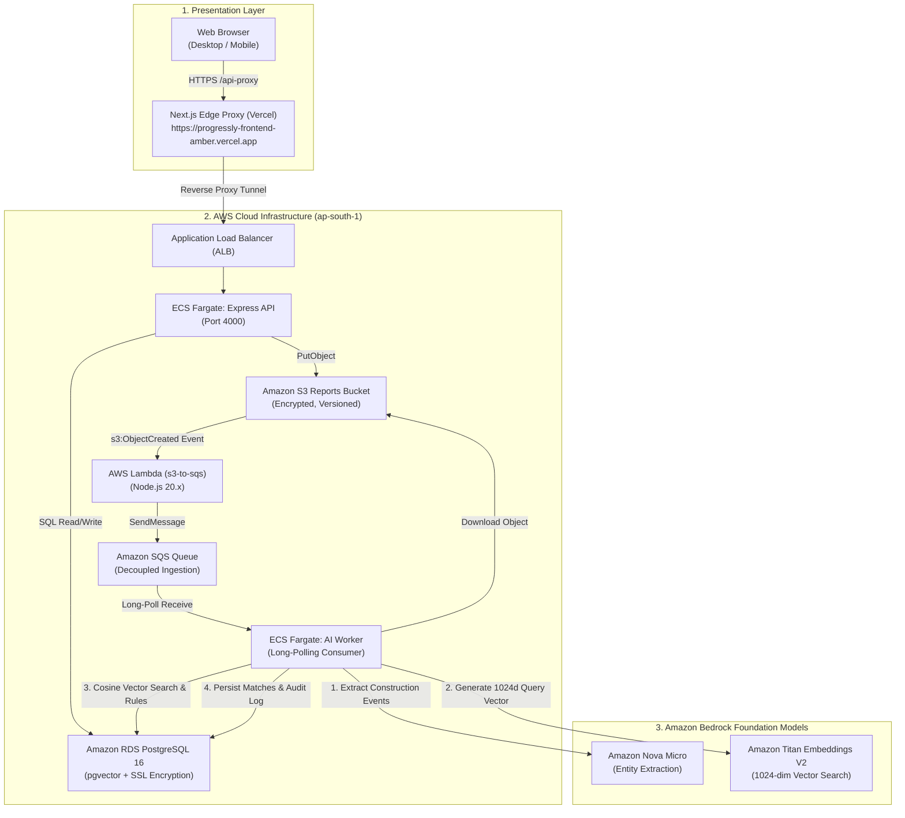

# Progressly (BridgeIQ) — Architecture, Feature Guide & Testing Manual

This document provides a comprehensive walkthrough of the **Progressly (BridgeIQ)** platform: its end-to-end event-driven architecture, key features, step-by-step testing instructions with copy-paste sample reports, UI component map, and a presentation demo script.

---

## 1. Executive Overview & Problem Statement

Large infrastructure, energy, and construction projects (such as oil & gas refineries, pipelines, and power plants) manage thousands of scheduled activities in complex Project Management systems (e.g. Primavera P6 / Oracle WBS). 

* **The Problem:** Daily site progress reports from field engineers are submitted as messy, unstructured free-text notes, PDFs, or spreadsheets. Human project planners spend hours manually matching daily field reports against schedule activity codes (e.g., matching *"welded joints on line 24"* to `L6-PIP-0243`).
* **The Progressly Solution:** Progressly is an **AI-driven schedule-linking and data capture layer** powered by AWS and Amazon Bedrock. It ingests unstructured site reports, uses LLMs (**Amazon Bedrock Nova Micro**) to extract technical construction events, performs semantic candidate retrieval with vector search (**Amazon Bedrock Titan Embeddings V2 + pgvector**), applies deterministic rule-based confidence scoring, and automatically updates the project schedule with full enterprise auditability.

---

## 2. End-to-End System Architecture & Data Flow



### The 5-Hop Event-Driven Pipeline
1. **Report Ingestion:** A site engineer submits text or uploads a file (`.txt`, `.pdf`, `.csv`, `.xlsx`, `.png`). The Express backend uploads it directly to the Amazon S3 reports bucket.
2. **Event Trigger:** S3 emits an `ObjectCreated` notification that invokes the `s3-to-sqs` Lambda function.
3. **Queue Buffering:** Lambda extracts the bucket name and object key and pushes a job item to Amazon SQS.
4. **AI Worker Processing:** The ECS AI Worker container long-polls SQS, downloads the raw file from S3, and calls:
   - **Amazon Bedrock Nova Micro** to extract structured construction entities (discipline, line number, location, work description, event type, quantity).
   - **Amazon Bedrock Titan Text Embeddings V2** to generate 1024-dimensional query embeddings.
   - **PostgreSQL `pgvector`** to retrieve candidate schedule activities using cosine distance `<=>`.
   - **Deterministic Rule Engine** to compute calibrated confidence scores.
5. **Database Persistence & Auditability:** Match records and audit provenance logs are written to RDS PostgreSQL with model versions and confidence scores.

---

## 3. Core Application Features

### 3.1 Policy-Gated Verification Queue
Matches are automatically categorized into three policy tiers based on confidence score:

| Confidence Tier | Score Range | Action Taken | UI Visual Badge |
|---|---|---|---|
| **Tier 1: Auto-Approved** | **≥ 95%** | Schedule activity progress is updated automatically. Logged in audit trail without requiring human intervention. | 🟢 **Auto-Approved (Green)** |
| **Tier 2: Planner Review** | **70% – 94%** | Routed to the human planner review queue. Planners click **Approve** or **Reject** with one click. | 🟡 **Planner Review (Orange)** |
| **Tier 3: Manual Resolution** | **< 70%** | Flagged for manual investigation or new WBS activity creation. | 🔴 **Manual Resolution (Red)** |

### 3.2 1024-Dimensional Semantic Search with Titan V2
* Schedule activities are pre-embedded in the `activities` table using Amazon Bedrock Titan Text Embeddings V2 (`amazon.titan-embed-text-v2:0`).
* Vector search retrieves relevant candidate activities even when engineers use different terminology (e.g. *"hydrotest"* vs *"pressure test"*, *"shuttering"* vs *"formwork"*).

### 3.3 Institutional Memory & Delay Risk Insights (RAG)
* The database contains **40 historical project records** capturing past construction delays, material shortages, and civil handover lags across past energy projects (Numaligarh, Duliajan, Jorhat, Moran).
* When matching new events, the AI Worker performs cosine similarity searches over historical records to surface contextual delay risks and lessons learned.

### 3.4 Immutable Audit Trail
* Every single prediction, model version, confidence score, raw prompt output, and human approval action is recorded in the `audit_log` table with timestamps.

---

## 4. Step-by-Step Testing Guide with Sample Inputs

### Accessing the Web App
Open the live production URL in your browser:
👉 **[https://progressly-frontend-amber.vercel.app/](https://progressly-frontend-amber.vercel.app/)**

---

### Test Case 1: Piping Spool Welding (Auto-Approval Tier $\ge$ 95%)

#### Purpose:
Demonstrates high-confidence automatic matching where discipline (`Piping`), line number (`24-XX`), and activity type (`Weld`) match the schedule activity `L6-PIP-0243`.

#### Input to Copy & Paste:
```text
Daily Construction & Progress Report - Baghjan Site
Date: 2026-08-28
Discipline: Piping
Location: Tank Farm
Supervisor: Chief Field Engineer R. Sharma

Activities Executed Today:
1. Completed welding on 14 spool joints for 24-inch crude header line 24-XX at Tank Farm area. Radiographic testing (RT) preparation underway for field joints.
```

#### How to Test:
1. Go to the **Upload Daily Report** card on the dashboard.
2. Select **Free Text Note** (or upload as a text file).
3. Paste the text above into the textarea.
4. Click **Upload & Process Report**.

#### Where to See the Result:
* Scroll to the **Matching & Verification Queue** section.
* **Matched Activity:** `L6-PIP-0243` (*Weld Line 24-XX Spool Joints*).
* **Confidence Score:** `95% (0.9500)`.
* **Status Badge:** 🟢 `Auto-Approved`.
* **Audit Log:** Check the **Audit Log** tab to see the automatic approval logged with `model_version: amazon.titan-embed-text-v2:0 + rule-engine-v1`.

---

### Test Case 2: Civil Foundation Raft (Planner Review Queue 70%–94%)

#### Purpose:
Demonstrates human-in-the-loop review. The AI identifies the activity but routes it to the planner for verification before modifying schedule baselines.

#### Input to Copy & Paste:
```text
Civil Works Progress - Tank Farm Sector
Date: 2026-08-28
Discipline: Civil
Supervisor: Senior Civil Foreman J. Das

Daily Summary:
Completed rebar tying and timber shuttering formwork for the main crude tank foundation raft at Tank Farm. Quality team inspected and cleared the area for tomorrow's concrete pour.
```

#### How to Test:
1. Paste the text above into the **Upload Daily Report** box.
2. Click **Upload & Process Report**.

#### Where to See the Result:
* Scroll to the **Matching & Verification Queue** section.
* **Matched Activity:** `L6-CIV-0112` (*Construct Tank Farm Foundation*).
* **Confidence Score:** `70% (0.7000)`.
* **Status Badge:** 🟡 `Pending Planner Review`.
* **Interactive Action:** Click the **Approve** button (green checkmark icon).
* **Effect:** The card turns green, updates status to `planner_approved`, and logs your approval in the Audit Log.

---

### Test Case 3: Electrical Cable Tray Installation

#### Purpose:
Tests electrical discipline extraction and spatial matching against Substation activities.

#### Input to Copy & Paste:
```text
Electrical & Substation Report - Unit 2
Date: 2026-08-28
Discipline: Electrical
Location: Substation

Work Completed:
Installed and secured 120 meters of heavy-duty perforated cable tray in Section 4 of the main substation building. Bracket supports torque-checked.
```

#### Expected Result:
* **Matched Activity:** `L6-ELE-0301` (*Install Cable Tray Section 4*).
* **Discipline:** `ELECTRICAL`.
* **Confidence Score:** `95% (0.9500)` $\rightarrow$ 🟢 `Auto-Approved`.

---

### Test Case 4: Multi-Discipline Combined Report

#### Purpose:
Demonstrates extracting multiple distinct events across different disciplines from a single consolidated site report.

#### Input to Copy & Paste:
```text
Baghjan Site Daily Progress Overview
Date: 2026-08-28

1. [Piping] Hydrotested 24-inch header Line 24-XX at Tank Farm up to 1.5x design pressure. Zero pressure drop recorded over 4-hour hold period.
2. [Static Equipment] Positioned and performed rough alignment for multi-stage feed pump skid P-101 at Pump House.
3. [HSE] Conducted mandatory safety toolbox talk and confined space entry inspection at Tank Farm before morning shift.
```

#### Expected Result:
Bedrock Nova Micro will split this single report into **3 separate structured events**:
1. Hydrotest on Line 24-XX $\rightarrow$ Matched to `L6-PIP-0189` (*Hydrotest Line 24-XX*).
2. Pump Skid P-101 Alignment $\rightarrow$ Matched to `L6-STE-0501` (*Align Pump Skid P-101*).
3. Confined Space Safety $\rightarrow$ Matched to `L6-HSE-0601` (*Conduct Confined Space Safety Audit*).

---

## 5. UI Component Map & Where to See Changes

```
┌─────────────────────────────────────────────────────────────────────────────┐
│  PROGRESSLY (BridgeIQ) | Intelligent Schedule-Linking Engine               │
├─────────────────────────────────────────────────────────────────────────────┤
│  [KPI 1: 15 Activities]   [KPI 2: Pending Matches]   [KPI 3: Approved]      │
├─────────────────────────────────────────────────────────────────────────────┤
│                                                                             │
│  ┌─────────────────────────────────┐  ┌──────────────────────────────────┐  │
│  │ 1. UPLOAD DAILY REPORT          │  │ 2. RECENT REPORTS FEED           │  │
│  │ - Free Text / File Upload       │  │ - Status: pending / processed    │  │
│  │ - Upload button                 │  │ - S3 Key & Timestamp             │  │
│  └─────────────────────────────────┘  └──────────────────────────────────┘  │
│                                                                             │
│  ┌───────────────────────────────────────────────────────────────────────┐  │
│  │ 3. MATCHING & VERIFICATION QUEUE (AI Engine)                          │  │
│  │ - Top Match Activity Code & Description                               │  │
│  │ - Confidence Score Meter (e.g. 95%)                                   │  │
│  │ - Policy Status: Auto-Approved 🟢 | Planner Review 🟡                │  │
│  │ - Interactive Action: [ Approve ✓ ]  [ Reject ✗ ]                     │  │
│  └───────────────────────────────────────────────────────────────────────┘  │
│                                                                             │
│  ┌───────────────────────────────────────────────────────────────────────┐  │
│  │ 4. BASELINE SCHEDULE & WBS HIERARCHY                                  │  │
│  │ - 15 Activities across Piping, Civil, Electrical, Instrumentation, HSE │  │
│  │ - Vector Embedding Status: [Titan V2 1024d ✓]                         │  │
│  └───────────────────────────────────────────────────────────────────────┘  │
│                                                                             │
│  ┌───────────────────────────────────────────────────────────────────────┐  │
│  │ 5. AUDIT LOG & PROVENANCE TRAIL                                       │  │
│  │ - Immutable log of AI extractions and human approvals                 │  │
│  │ - Model versioning and confidence score provenance                    │  │
│  └───────────────────────────────────────────────────────────────────────┘  │
└─────────────────────────────────────────────────────────────────────────────┘
```

---

## 6. Verification via Terminal & PowerShell

You can query all production database tables and endpoints directly via PowerShell:

```powershell
# 1. Check API Health
Invoke-RestMethod -Uri "http://progressly-alb-prod-1551208303.ap-south-1.elb.amazonaws.com/health" -Method Get

# 2. View all 15 Baseline Schedule Activities and Embedding Status
Invoke-RestMethod -Uri "http://progressly-alb-prod-1551208303.ap-south-1.elb.amazonaws.com/activities" -Method Get

# 3. View All Uploaded Reports
Invoke-RestMethod -Uri "http://progressly-alb-prod-1551208303.ap-south-1.elb.amazonaws.com/reports" -Method Get

# 4. View All Extracted Matches & AI Predictions
Invoke-RestMethod -Uri "http://progressly-alb-prod-1551208303.ap-south-1.elb.amazonaws.com/matches" -Method Get
```

---

## 7. 3-Minute Presentation / Demo Script

Use this script when presenting to judges, evaluators, or project stakeholders:

### Minute 1: The Problem & The Solution
> *"Welcome to Progressly. In mega-infrastructure projects, billions of dollars are lost to schedule delays. Site engineers submit hundreds of messy unstructured daily notes from the field, while planners struggle to manually map them to thousands of WBS schedule activity codes.*
> 
> *Progressly solves this by providing an intelligent, event-driven data capture and schedule-linking layer powered by AWS and Amazon Bedrock."*

### Minute 2: Live Ingestion & AI Matching Demo
> *"Let's see it in action. Here we have our baseline project schedule with 15 engineering activities across Piping, Civil, Electrical, and HSE — each pre-embedded with 1024-dimensional vectors using Amazon Bedrock Titan Text Embeddings V2.*
> 
> *Now, imagine I am a field engineer submitting today's site report with raw unstructured notes: 'Welded 14 spool joints on crude header line 24-XX at Tank Farm.'*
> 
> *When I click upload, the file lands in S3, triggers a Lambda function, buffers in SQS, and our Fargate AI Worker executes Bedrock Nova Micro to extract the structured construction events."*

### Minute 3: Policy Gating & Enterprise Compliance
> *"Notice the result: The AI matched the event to activity `L6-PIP-0243` with a 95% confidence score and automatically approved it based on our strict policy guardrails.*
> 
> *For ambiguous events, the system routes them to our Planner Review Queue where engineers can approve or reject with one click. Every single prediction, confidence score, and model version is immutably recorded in our compliance audit log.*
> 
> *The entire infrastructure is containerized on ECS Fargate, backed by PostgreSQL 16 with pgvector on AWS RDS, and live right now."*
