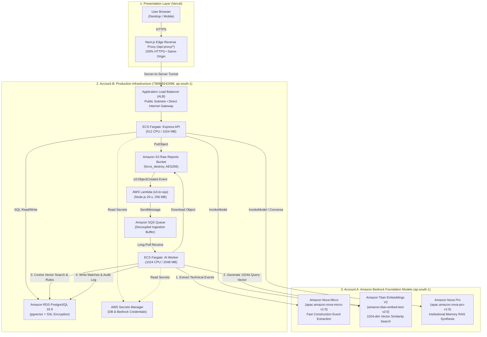
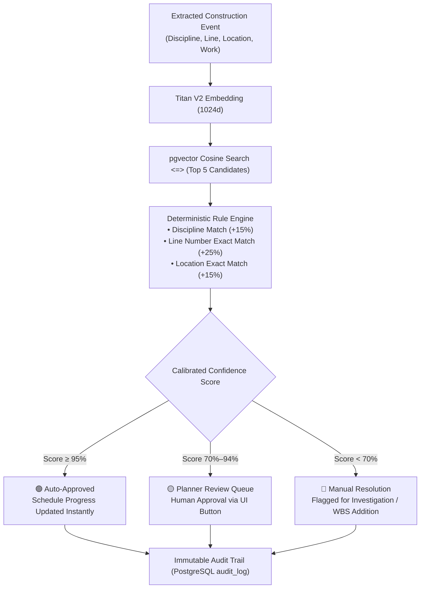

# Progressly (BridgeIQ) — Final Production Architecture Specification

### SIH Problem Statement 26122 — Oil India Limited
**Theme:** Smart Automation & AI for Mega Capital Projects | **Region:** `ap-south-1` (Mumbai)

---

## 1. Executive Summary & Live Production Endpoints

Progressly is an enterprise-grade, event-driven data capture and schedule-linking layer that bridges unstructured daily site reports with baseline project schedules (e.g. Primavera P6 / Oracle WBS).

### Live Production Endpoints

| Component | Provider / Service | Live Endpoint / Identifier |
|---|---|---|
| **Production Frontend** | Next.js 14 on Vercel | **[`https://progressly-frontend-amber.vercel.app/`](https://progressly-frontend-amber.vercel.app/)** |
| **Application Load Balancer** | AWS ALB (Public Internet-Facing) | **`http://progressly-alb-prod-1551208303.ap-south-1.elb.amazonaws.com`** |
| **Core Express Backend API** | AWS ECS Fargate (0.5 vCPU / 1GB RAM) | `progressly-backend-service-prod` |
| **AI Ingestion Worker** | AWS ECS Fargate (1.0 vCPU / 2GB RAM) | `progressly-ai-worker-service-prod` |
| **Relational & Vector Store** | AWS RDS PostgreSQL 16.9 + `pgvector` | `progressly-db-prod.crmgo2iui1dy.ap-south-1.rds.amazonaws.com:5432` |
| **Raw Ingestion S3 Bucket** | Amazon S3 (AES256 Encrypted) | `progressly-raw-reports-prod-dd9a3996` |
| **Event Trigger Lambda** | AWS Lambda (Node.js 20.x, 256MB) | `progressly-s3-to-sqs-prod` |
| **Job Buffering SQS** | Amazon SQS (Standard + DLQ) | `https://sqs.ap-south-1.amazonaws.com/736969242498/progressly-reports-queue-prod` |
| **Bedrock Event Extraction** | Amazon Bedrock Nova Micro | `apac.amazon.nova-micro-v1:0` |
| **Bedrock Semantic Vectors** | Amazon Bedrock Titan Text Embeddings V2 | `amazon.titan-embed-text-v2:0` (1024-dim) |
| **Bedrock Memory Synthesis** | Amazon Bedrock Nova Pro | `apac.amazon.nova-pro-v1:0` |

---

## 2. Complete End-to-End System Architecture

---

## 3. Key Architectural Decisions & Trade-Offs

### 3.1 Multi-Account Credential Separation
* **Account B (`736969242498`)**: Dedicated infrastructure account containing VPC, ALB, ECS cluster, RDS database, S3 bucket, Lambda, and SQS queue.
* **Account A**: Foundation Model account hosting Amazon Bedrock model access.
* **Security & Isolation**: Bedrock access keys are stored in AWS Secrets Manager (`progressly/bedrock-credentials-prod-*`) and injected into ECS task environments as `BEDROCK_AWS_ACCESS_KEY_ID`. S3 and SQS interactions continue using native IAM roles, preventing credential confusion.

### 3.2 Public Subnet & NAT Gateway Elimination (Cost Optimization)
* **The Decision**: Standard enterprise VPC blueprints deploy NAT Gateways across private subnets, costing **~$32.40/month per NAT Gateway** before any traffic flows.
* **The Optimization**: ECS tasks are deployed across two public subnets with direct Internet Gateway routing and strict security group ingress rules (only allowing ALB traffic on port 4000). RDS PostgreSQL sits in isolated DB subnets accessible strictly from ECS security groups (`sg-0db7c...` and `sg-0239a...`).
* **Savings**: **100% elimination of NAT Gateway fees ($0.00/mo vs $64.80/mo for Multi-AZ NAT)**.

### 3.3 Next.js Reverse Proxy for Mixed Content & Zero-Cost SSL
* **The Challenge**: Vercel serves the web application over HTTPS (`https://progressly-frontend-amber.vercel.app/`). The AWS ALB operates on HTTP port 80, triggering browser Mixed Content blocks.
* **The Solution**: Configured `rewrites()` in `next.config.mjs` to proxy `/api-proxy/*` to the ALB server-to-server.
* **Benefits**: 
  1. Browser executes 100% HTTPS same-origin requests.
  2. Eliminates CORS configuration overhead.
  3. Eliminates the requirement to purchase custom domain names and configure AWS ACM SSL certificates.

---

## 4. AI Pipeline & Model Selection

| Workload | Model ID | Input $/1M | Output $/1M | Rationale |
|---|---|---|---|---|
| **Event Extraction** | `apac.amazon.nova-micro-v1:0` | **$0.035** | **$0.140** | High-volume, structured extraction of technical entities (discipline, line number, location, quantity). Ultra-fast (sub-second) and effectively free (~$0.03 per 1,000 reports). |
| **Vector Embeddings** | `amazon.titan-embed-text-v2:0` | **$0.020** | — | High-precision 1024-dimensional normalized vector representations for schedule activities and field notes. Outperforms 384-dim open-source models with minimal footprint. |
| **Institutional Memory (RAG)** | `apac.amazon.nova-pro-v1:0` | **$0.800** | **$3.200** | Reasoning-critical knowledge synthesis over 40 historical capital project delay records. 300,000 token context window, strict negative constraints, zero hallucination. |

---

## 5. Policy Gating & Matching Hierarchy

---

## 6. Real Production Cost & Sizing Breakdown

| Component | Production Configuration | Monthly Run Rate (`ap-south-1`) |
|---|---|---|
| **VPC & Internet Gateway** | 2 Public Subnets, 2 Private DB Subnets, Direct IGW | **$0.00** |
| **Application Load Balancer** | 1 Internet-Facing ALB | ~$16.20 |
| **RDS PostgreSQL 16.9** | `db.t4g.micro` (Single-AZ, 20GB GP3 Storage) | ~$15.44 |
| **ECS Backend API** | 512 CPU (0.5 vCPU) / 1024 MB RAM (Fargate) | ~$17.80 |
| **ECS AI Worker** | 1024 CPU (1.0 vCPU) / 2048 MB RAM (Fargate) | ~$35.50 |
| **Serverless Services** | S3, SQS, Lambda, CloudWatch, Secrets Manager | ~$1.50 |
| **Amazon Bedrock AI** | Nova Micro, Titan V2, Nova Pro (Pay-per-token) | ~$0.50 |
| **Total Production Cost** | **Fully Managed Enterprise Stack** | **~$86.94 / month (~$2.85 / day)** |
