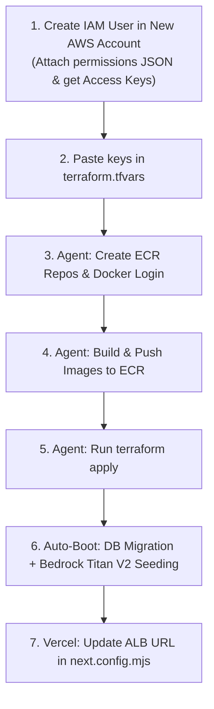

# Progressly — Infrastructure Operations & Cost Safety Manual

This manual provides a battle-tested, 100% automated guide to managing AWS infrastructure costs, executing zero-cost teardowns, and launching the complete production stack into a fresh AWS account (e.g. new $200 credit/free-tier accounts) in under 5 minutes.

---

## 1. Clean Teardown (`terraform destroy`) & Zero-Cost Guarantee

When you run `terraform destroy`, **100% of paid AWS resources are terminated and deleted**, immediately dropping the hourly burn rate to **$0.00/hour**.

### Why no background costs remain:
* **S3 Raw Reports Bucket:** (`force_destroy = true`) Automatically empties all uploaded reports, PDFs, and versions before deleting the bucket itself.
* **RDS PostgreSQL Database:** (`skip_final_snapshot = true` and `deletion_protection = false`) Terminates instantly without creating persistent snapshot storage fees.
* **AWS Secrets Manager:** (`recovery_window_in_days = 0`) Immediately purges secrets instead of retaining them in AWS's 30-day paid pending-recovery state.
* **ECS Fargate Tasks & ALB:** Tasks stop execution immediately; Application Load Balancer and Target Groups are deleted.
* **VPC, Subnets, Route Tables, SQS, Lambda, CloudWatch:** Fully deleted.

> [!NOTE]
> The only items remaining in AWS after `terraform destroy` are:
> 1. The IAM user you created (`progressly-terraform`) — **$0.00 cost** (IAM is free).
> 2. The `AWSServiceRoleForECS` service-linked role — **$0.00 cost** (IAM roles are free).

### Command to Destroy:
```powershell
cd terraform
terraform destroy -auto-approve
```

---

## 2. The "One-Prompt" Re-Deployment Workflow (Account 2)

When switching to Account 2, you only need to perform **Step 1 & Step 2**, paste your new keys in `terraform.tfvars`, and prompt the agent:

> *"I have pasted the new AWS keys in terraform.tfvars. Deploy and seed the entire infrastructure."*

The agent will do 100% of the heavy lifting automatically.



---

### Step 1: In the New AWS Account (Console)

1. **Create the Terraform IAM User:**
   * Open AWS Console $\rightarrow$ **IAM** $\rightarrow$ **Users** $\rightarrow$ **Create User** (`progressly-terraform`).
   * Choose **Attach policies directly** $\rightarrow$ **Create Policy** $\rightarrow$ Click **JSON** tab $\rightarrow$ Paste the policy below:

```json
{
    "Version": "2012-10-17",
    "Statement": [
        {
            "Sid": "InfraProvisioning",
            "Effect": "Allow",
            "Action": [
                "ec2:*",
                "ecs:*",
                "ecr:*",
                "elasticloadbalancing:*",
                "rds:*",
                "s3:*",
                "sqs:*",
                "lambda:*",
                "iam:CreateRole",
                "iam:DeleteRole",
                "iam:AttachRolePolicy",
                "iam:DetachRolePolicy",
                "iam:PutRolePolicy",
                "iam:DeleteRolePolicy",
                "iam:PassRole",
                "iam:GetRole",
                "iam:ListRolePolicies",
                "iam:ListAttachedRolePolicies",
                "iam:CreateInstanceProfile",
                "iam:DeleteInstanceProfile",
                "iam:AddRoleToInstanceProfile",
                "iam:RemoveRoleFromInstanceProfile",
                "iam:TagRole",
                "logs:*",
                "secretsmanager:*",
                "cloudwatch:*",
                "application-autoscaling:*",
                "iam:CreateServiceLinkedRole",
                "iam:CreatePolicy",
                "iam:DeletePolicy",
                "iam:GetPolicy",
                "iam:ListPolicyVersions",
                "sns:*",
                "iam:TagPolicy",
                "iam:UntagPolicy",
                "iam:GetPolicyVersion"
            ],
            "Resource": "*"
        }
    ]
}
```
   * Name policy `ProgresslyInfraPolicy`, create it, and attach it to the user.
   * Go to **Security Credentials** $\rightarrow$ **Create Access Key** $\rightarrow$ Select **Command Line Interface (CLI)**.
   * Copy the **Access Key ID** (`AKIA...`) and **Secret Access Key**.

2. **Run One-Time Service-Linked Role Command:**
   ```powershell
   $env:AWS_ACCESS_KEY_ID="NEW_ACCOUNT_ACCESS_KEY"
   $env:AWS_SECRET_ACCESS_KEY="NEW_ACCOUNT_SECRET_KEY"
   $env:AWS_DEFAULT_REGION="ap-south-1"

   aws iam create-service-linked-role --aws-service-name ecs.amazonaws.com
   ```
   *(If it returns `Role already exists`, you can safely proceed).*

3. **Enable Amazon Bedrock Foundation Models (in Bedrock Account):**
   * Open **Amazon Bedrock Console** $\rightarrow$ **Model Access** $\rightarrow$ Request access for:
     * **Amazon Nova Micro** (`apac.amazon.nova-micro-v1:0` or `amazon.nova-micro-v1:0`)
     * **Amazon Titan Embeddings V2** (`amazon.titan-embed-text-v2:0`)
     * **Amazon Nova Pro** (`apac.amazon.nova-pro-v1:0` or `amazon.nova-pro-v1:0`)

---

### Step 2: Update `terraform/terraform.tfvars`

Paste your new credentials and account ID:

```hcl
project_name = "progressly"
environment  = "prod"

# Account B: Infrastructure Account
infra_aws_region     = "ap-south-1"
infra_aws_access_key = "NEW_ACCOUNT_ACCESS_KEY"
infra_aws_secret_key = "NEW_ACCOUNT_SECRET_KEY"

# Account A: Bedrock AI Account (Can be same or separate account)
bedrock_aws_region     = "ap-south-1"
bedrock_aws_access_key = "NEW_BEDROCK_ACCESS_KEY"
bedrock_aws_secret_key = "NEW_BEDROCK_SECRET_KEY"

# Database Credentials
db_name     = "progressly_db"
db_username = "progressly_admin"
db_password = "YourSecurePassword2026!"

# Container Image URIs
backend_container_image   = "<NEW_ACCOUNT_ID>.dkr.ecr.ap-south-1.amazonaws.com/progressly-backend:latest"
ai_worker_container_image = "<NEW_ACCOUNT_ID>.dkr.ecr.ap-south-1.amazonaws.com/progressly-ai-worker:latest"
```

---

### Step 3: What the Agent Executes (Or Run Manually)

```powershell
# 1. Set environment variables
$env:AWS_ACCESS_KEY_ID="NEW_ACCOUNT_ACCESS_KEY"
$env:AWS_SECRET_ACCESS_KEY="NEW_ACCOUNT_SECRET_KEY"
$env:AWS_DEFAULT_REGION="ap-south-1"
$pass = aws ecr get-login-password --region ap-south-1

# 2. Create ECR Repositories & Login Docker
aws ecr create-repository --repository-name progressly-backend --region ap-south-1
aws ecr create-repository --repository-name progressly-ai-worker --region ap-south-1
docker login --username AWS --password $pass <NEW_ACCOUNT_ID>.dkr.ecr.ap-south-1.amazonaws.com

# 3. Build & Push Docker Images
docker build -t <NEW_ACCOUNT_ID>.dkr.ecr.ap-south-1.amazonaws.com/progressly-backend:latest -f backend/Dockerfile backend
docker build -t <NEW_ACCOUNT_ID>.dkr.ecr.ap-south-1.amazonaws.com/progressly-ai-worker:latest -f ai-worker/Dockerfile ai-worker
docker push <NEW_ACCOUNT_ID>.dkr.ecr.ap-south-1.amazonaws.com/progressly-backend:latest
docker push <NEW_ACCOUNT_ID>.dkr.ecr.ap-south-1.amazonaws.com/progressly-ai-worker:latest

# 4. Deploy Infrastructure via Terraform
$env:Path = [System.Environment]::GetEnvironmentVariable("Path","Machine") + ";" + [System.Environment]::GetEnvironmentVariable("Path","User")
cd terraform
Remove-Item -Recurse -Force .terraform, terraform.tfstate, terraform.tfstate.backup -ErrorAction SilentlyContinue
terraform init
terraform apply -auto-approve
```

---

## 3. What Happens 100% Automatically on Boot

Every single one of these capabilities is permanently baked into the repository code:

1. **Schema Migrations:** The backend container boots up inside the VPC, connects to RDS PostgreSQL over encrypted SSL (`?sslmode=no-verify`), initializes `pgvector` and `uuid-ossp` extensions, creates all 9 relational tables, and registers the demo project.
2. **Bedrock Titan V2 Baseline Seeding:** The AI worker boots up, detects empty tables, and automatically calls Amazon Bedrock Titan Text Embeddings V2 (`amazon.titan-embed-text-v2:0`) to embed:
   - **All 15 baseline schedule activities** into `activities` (`has_embedding: true`, 1024-dim vectors).
   - **All 40 institutional memory records** into `historical_records` (1024-dim vectors).
3. **Event-Driven Ingestion Pipeline:**
   - Files uploaded to `POST /reports` or directly to S3 are stored in `progressly-raw-reports-prod-*`.
   - S3 `ObjectCreated` triggers Lambda (`s3-to-sqs`).
   - Lambda enqueues to SQS (`reports-queue-prod`).
   - AI Worker long-polls SQS, downloads from S3, runs Bedrock Nova Micro (`apac.amazon.nova-micro-v1:0`) event extraction, runs Bedrock Titan V2 semantic matching, and inserts results into `actual_events`, `matches`, and `audit_log`.
4. **Next.js Reverse Proxy:** `frontend/next.config.mjs` proxies all browser API calls (`/api-proxy/*`) to the ALB, eliminating Mixed Content and CORS errors completely.

---

## 4. Cost Guardrails & Architecture Summary

| Component | Hackathon Sizing | Estimated Cost (`ap-south-1`) |
|---|---|---|
| **NAT Gateway** | **REMOVED** (ECS uses direct Internet Gateway) | **$0.00 / month** (Saves ~$32.40/mo) |
| **Application Load Balancer** | 1x Internet-Facing ALB | ~$16.20 / month |
| **RDS PostgreSQL 16** | `db.t4g.micro` (Single-AZ, 20GB GP3) | ~$15.44 / month |
| **ECS Backend API** | 512 CPU (0.5 vCPU) / 1024 MB RAM | ~$17.80 / month |
| **ECS AI Worker** | 1024 CPU (1.0 vCPU) / 2048 MB RAM | ~$35.50 / month |
| **S3, SQS, Lambda, Secrets, Logs** | Serverless / Pay-per-use | < $1.50 / month |
| **CloudWatch Billing Alarm** | Active in `us-east-1` at **$25 threshold** | **$0.00** (Included in free tier) |
| **Total Run Rate** | **~$2.85 / day** (~$86.44 / month) | **~$8.50 - $11.50 for 3–4 day demo** |

---

## 5. Verification Commands

To verify the deployment from your terminal:

```powershell
# 1. Check API Health
Invoke-RestMethod -Uri "http://<ALB_DNS_NAME>/health" -Method Get

# 2. Check Seeded Activities (should return 15 activities with embeddings)
Invoke-RestMethod -Uri "http://<ALB_DNS_NAME>/activities" -Method Get

# 3. Check Extracted Matches
Invoke-RestMethod -Uri "http://<ALB_DNS_NAME>/matches" -Method Get
```
